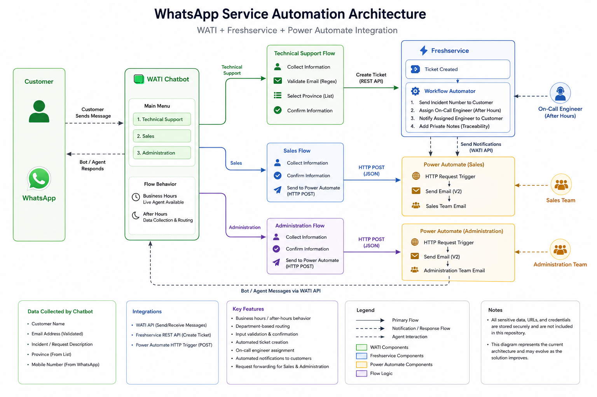

# WhatsApp Service Automation

A service automation solution that integrates **WhatsApp, WATI, Freshservice, Power Automate, and REST APIs** to streamline customer requests, incident creation, routing, and automated notifications.

## Overview

This project was designed to provide an official WhatsApp-based service channel where customers can interact with different business areas and submit requests without depending exclusively on live-agent availability.

The solution supports three main service areas:

* Technical Support
* Sales
* Administration

Depending on the selected department and business hours, the chatbot can transfer the conversation to an available agent, collect customer information for later follow-up, or automatically create a support ticket.

## My Contribution

I designed and implemented the solution architecture and automation workflows documented in this repository.

My contribution included:

* Designing the WATI chatbot flows for business-hours and after-hours scenarios
* Defining department-based routing for Technical Support, Sales, and Administration
* Implementing structured customer data collection and input validation
* Integrating WATI with the Freshservice REST API for automated ticket creation
* Configuring Freshservice workflows for incident-number notifications and On-Call engineer assignment
* Implementing the Freshservice-to-WATI integration used to send automated WhatsApp updates
* Designing the message sequencing logic to preserve the correct notification order
* Creating Power Automate HTTP-triggered flows for after-hours Sales and Administration requests
* Adding operational traceability through Freshservice private notes
* Identifying current limitations and opportunities for future automation improvements

The solution was built from an initial requirement to provide an official WhatsApp service channel and evolved into a multi-system automation that combines customer interaction, ticketing, routing, internal notifications, and REST API integrations.

## Problem & Solution

### Problem

The initial requirement was to establish an official WhatsApp service channel that could support customer communication beyond a traditional live-agent model.

The existing process did not provide a structured way to route requests, capture customer information outside business hours, or automatically create and process technical support incidents.

### Solution

The implemented solution uses WATI as the customer interaction layer and routes requests according to department and business hours.

Technical Support requests can be converted into Freshservice tickets through the REST API, while Freshservice workflows handle incident notifications and On-Call engineer assignment.

Sales and Administration requests received outside business hours are captured by the chatbot and forwarded to Power Automate, which generates structured internal email notifications for follow-up.

The result is a multi-system workflow that connects customer communication, request routing, ticket creation, internal notifications, and automated WhatsApp updates.

## Main Technologies

* WATI
* WhatsApp Business
* Freshservice
* Microsoft Power Automate
* REST APIs
* JSON
* HTTP Webhooks

## Key Features

* Business-hours and after-hours chatbot flows
* Department-based request routing
* Input validation and structured data collection
* Automated Freshservice ticket creation
* Automatic incident-number notification through WhatsApp
* On-call engineer assignment outside business hours
* Automated WhatsApp notification after engineer assignment
* Sales and Administration request forwarding through Power Automate
* Operational traceability using Freshservice private notes
* Navigation and error handling within chatbot flows

## High-Level Architecture



## Repository Purpose

This repository documents the architecture, integration logic, implementation decisions, and sanitized examples of the solution.

It does **not** contain production credentials, API keys, customer information, internal URLs, or other confidential company data.

## Documentation

Detailed documentation is available in the `docs` directory:

* [Solution Architecture](docs/architecture.md) — overall system architecture, routing logic, integrations, limitations, and improvement opportunities.
* [WATI Chatbot Flow](docs/chatbot-flow.md) — customer interaction flow, business-hours logic, validation, navigation, and department routing.
* [Freshservice Workflows](docs/freshservice-workflows.md) — ticket creation, customer notifications, On-Call assignment, workflow sequencing, and traceability.
* [Power Automate Integration](docs/power-automate.md) — after-hours Sales and Administration request processing and email notification flows.

## Technical Examples

Sanitized integration examples are available in the `examples` directory:

* [Freshservice Ticket Payload](examples/freshservice-ticket-payload.json)
* [Power Automate Request](examples/power-automate-request.json)
* [WATI Notification Examples](examples/wati-notification-examples.md)

All examples use fictitious or sanitized values. No production credentials, customer data, internal URLs, or authentication tokens are included.

## Repository Structure

```text
whatsapp-service-automation/
│
├── README.md
│
├── docs/
│   ├── architecture.md
│   ├── chatbot-flow.md
│   ├── freshservice-workflows.md
│   └── power-automate.md
│
├── examples/
│   ├── freshservice-ticket-payload.json
│   ├── power-automate-request.json
│   └── wati-notification-examples.md
│
└── images/
    ├── architecture-diagram.png
    ├── end-to-end-notification.png
    └── wati-chatbot-flow.png
```

## Project Status

The solution described in this repository represents a completed functional implementation.

The repository focuses on documenting the architecture and integration logic while identifying opportunities for future improvements such as automated On-Call rotation, enhanced error handling, stronger endpoint security, and more advanced ITSM classification.
