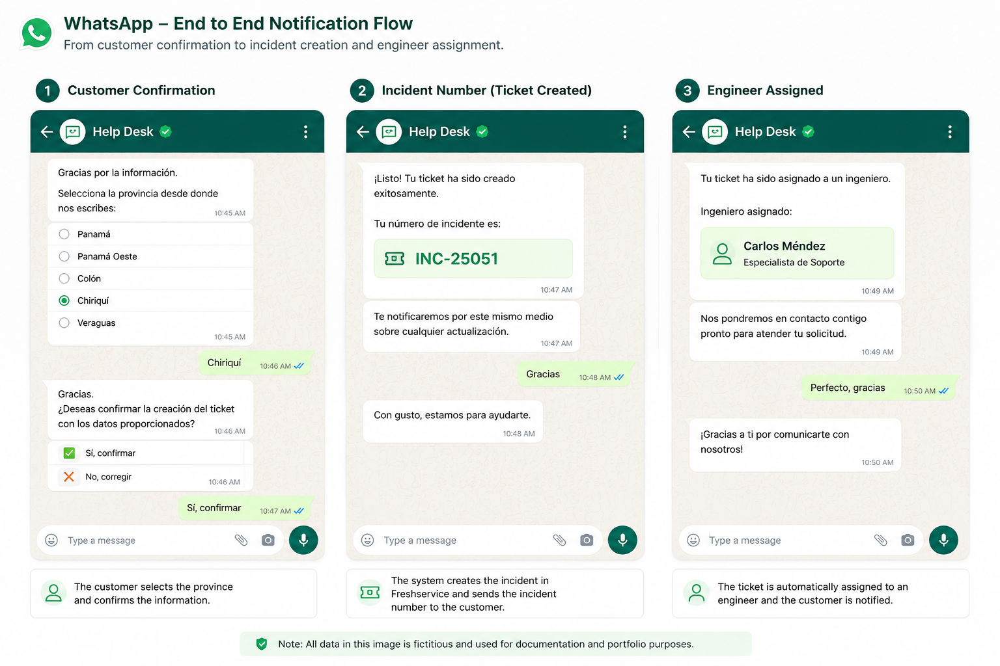

# Freshservice Workflows

## Overview

Freshservice is used as the IT service management platform for technical support requests created through the WhatsApp chatbot.

WATI creates the ticket through the Freshservice REST API, while Freshservice Workflow Automator manages post-creation processing such as:

* Sending the incident number back to the customer through WhatsApp
* Assigning the configured On-Call engineer
* Sending the assigned engineer information to the customer
* Adding private notes for operational traceability

The workflows are designed specifically for tickets generated through the WhatsApp integration.

---

## Ticket Creation

Ticket creation is initiated from WATI after the customer confirms the information collected by the chatbot.

WATI sends an HTTP POST request to the Freshservice ticket endpoint:

```text
POST https://<freshservice-domain>/api/v2/tickets
```

Authentication uses Freshservice API credentials.

A sanitized example of the request body is:

```json
{
  "email": "@email",
  "subject": "WhatsApp Support: @name",
  "description": "<b>New Incident:</b><br><br><b>User:</b> @name<br><b>Province:</b> @province<br><b>Phone:</b> {{phone}}<br><br><b>Details:</b><br>@description",
  "phone": "{{phone}}",
  "priority": 1,
  "status": 2,
  "custom_fields": {
    "province": "@province",
    "mobile_number": "{{phone}}"
  }
}
```

Production domain names, credentials, field identifiers, and other internal values are intentionally excluded.

---

# Workflow 1: Incident Number Notification

## Workflow Name

```text
WhatsApp - Número de incidente
```

## Trigger

The workflow starts when:

```text
Ticket is created
```

## Conditions

All conditions must be satisfied:

```text
Ticket subject contains "WhatsApp"
Mobile number is not empty
```

These conditions prevent the workflow from executing for unrelated tickets and ensure that a WhatsApp destination is available.

## Action

Freshservice triggers an outbound HTTP POST request to the WATI REST API.

The endpoint follows this structure:

```text
POST https://<wati-server>/api/v1/sendSessionMessage/{{ticket.mobile_number}}
```

The production integration uses WATI API authentication.

The request uses form-urlencoded content.

A sanitized example of the outgoing message is:

```text
messageText=Dear customer, your request has been registered with incident number {{ticket.id}}. Our technical team will review your case shortly.
```

The ticket ID is dynamically obtained from the Freshservice ticket created through the API.

## Operational Traceability

After the notification is triggered, the workflow adds a private note to the Freshservice ticket.

This note provides a simple operational indicator that the WhatsApp notification workflow was executed.

The note is not required for the integration itself but makes validation and troubleshooting easier from within the ticket.

---

# Workflow 2: On-Call Engineer Assignment

The On-Call assignment logic uses multiple equivalent workflows because of scheduling limitations in the current Freshservice configuration.

The workflows share the same assignment and notification logic.

The main difference between them is the schedule condition.

One representative workflow is documented below.

## Workflow Name

```text
Ingeniero - Fuera de horario laboral
```

## Trigger

The workflow starts when:

```text
Ticket is created
```

## Conditions

All of the following conditions must be satisfied:

```text
Ticket created during configured non-working hours
Assigned Engineer is None
Ticket subject contains "WhatsApp"
```

The first condition identifies tickets created during the corresponding time window.

The second condition prevents reassignment when an engineer is already present.

The WhatsApp subject condition limits the automation to tickets created through this integration.

---

## Engineer Assignment

After the conditions are satisfied, Freshservice assigns the configured engineer.

Conceptually:

```text
Set Assigned Engineer = Current On-Call Engineer
```

The engineer value is selected from the available Freshservice field values.

The current implementation requires the On-Call engineer to be updated manually when the rotation changes.

---

## Message Sequencing

After assigning the engineer, the workflow waits:

```text
60 seconds
```

This delay is intentional.

The incident-number workflow and the engineer-assignment workflow can execute almost simultaneously after ticket creation.

During initial testing, this could result in the engineer-assignment message reaching the customer before the incident-number message.

The 60-second timer, which is the minimum available timer value in the current workflow configuration, was introduced to preserve the intended customer communication sequence.

The intended order is:

```text
1. Ticket is created
2. Customer receives the incident number
3. Engineer is assigned
4. Customer receives the assigned engineer notification
```

---

## Engineer Assignment Notification

After the timer expires, Freshservice triggers another HTTP POST request to the WATI REST API.

The endpoint follows the same messaging pattern:

```text
POST https://<wati-server>/api/v1/sendSessionMessage/{{ticket.mobile_number}}
```

The outgoing message dynamically uses the Freshservice ticket ID and assigned engineer name.

Sanitized example:

```text
messageText=Update for case {{ticket.id}}: your request has been assigned to {{ticket.assigned_agent.name}}, who will be responsible for handling your case. Further follow-up will be provided via email.
```

## End-to-End Notification Example



The image above shows the customer-facing sequence from confirmation through ticket creation and engineer assignment using fictitious data for documentation purposes.

This demonstrates the bidirectional integration between WATI and Freshservice:

```text
WATI
  |
  | Create ticket
  v
Freshservice
  |
  | Process ticket and assignment
  v
WATI API
  |
  v
WhatsApp customer notification
```

---

## Assignment Workflow Variants

Three equivalent assignment workflows are currently used.

They exist because the required schedule could not be represented as a single continuous schedule within the available Freshservice configuration.

The workflows use the same general logic:

```text
Ticket created
      |
      v
Validate schedule and ticket conditions
      |
      v
Assign current On-Call engineer
      |
      v
Wait 60 seconds
      |
      v
Send assignment notification through WATI
      |
      v
Add private traceability note
```

Only the schedule condition differs between the workflow variants.

---

## On-Call Maintenance

The On-Call engineer currently changes on a recurring rotation.

The engineer assignment is manually updated in each of the three assignment workflows when the responsible engineer changes.

This was accepted as a practical implementation decision for the initial version of the solution.

It remains one of the main opportunities for future automation.

---

## Known Limitations

The current Freshservice implementation includes the following limitations:

* On-Call rotation is maintained manually.
* The assigned engineer must be updated in three workflow variants.
* Schedule logic is duplicated between workflows.
* Message sequencing depends on a fixed 60-second delay.
* Ticket metadata and ITSM classification can be expanded further.
* Workflow error handling and retry logic can be improved.

---

## Potential Improvements

Future iterations could include:

* Centralized On-Call roster management
* Automatic engineer rotation
* Dynamic assignment based on an external schedule
* Elimination of duplicated scheduling workflows
* Event-based message sequencing instead of a fixed timer
* Webhook retry handling
* Failure notifications and centralized logging
* Additional ticket categorization and classification
* More advanced SLA and incident-processing rules

---

## Security

The production implementation contains authentication information for both Freshservice and WATI.

This repository does not contain:

* Freshservice API keys
* WATI API keys or bearer tokens
* Production endpoint identifiers
* Internal company URLs
* Customer information
* Corporate mobile numbers or email addresses

All examples in this documentation are sanitized representations of the production implementation.
